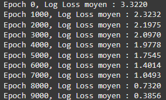

# Neural Network Model for Diabetes Prediction

## Overview

This repository contains two branches, each focusing on different stages of developing a neural network model for predicting diabetes. These branches allow us to test and visualize the model using both a simplified dataset and a final dataset for real-world application.

To get started, it was necessary to learn the basics of neural networks by working directly with a dataset. However, our main dataset (768 rows and 9 columns) was too large to test a simple model. Therefore, we decided to generate a custom dataset using Python. This led to the creation of two branches:

- **Branch 1 (main)**: Contains a simplified dataset to test basic neural network functionality.
- **Branch 2 (model-2)**: Implements the final model using the larger dataset for diabetes prediction.

Both branches include visualizations of the model using SDL, enabling a clear view of the model's structure and progress.

### Branch 1: Main  **Simplified Dataset and Basic Model**

1. **Creation of a Simplified Dataset**:
   - Generated a custom dataset with 100 rows and 2 input columns.
   - The input parameters are stored in a CSV file, and the expected outputs in a separate CSV file.

2. **Implementation of a Simple Neural Network Model**:
   - Designed a model with 2 input neurons, 2 hidden layer with 4 neurons, and 1 output neuron.
   - Trained the model using the simplified dataset and achieved a minimum loss function (J) of **0.03592** after several iterations.

3. **Model Visualization with SDL**:
   - The model structure and training process are visualized using SDL, showing the neural network’s layers and the progress of the training.

---

### Branch 2: Model-2 **Final Model for Diabetes Prediction**

1. **Dataset Source**:
   - The dataset was sourced from Kaggle, containing 767 rows and 9 columns.

2. **Dataset Splitting**:
   - Split the dataset into 70% for training and 30% for testing.

3. **Data Preparation**:
   - Addressed data disparity by applying **data normalization** to scale all input features to a range between 0 and 1.

4. **Hyperparameter Exploration**:
   - Experimented with various configurations including the number of hidden layers, neurons per layer, and learning rate.
   - After trials, the optimal configuration was found to be:
     - **4 hidden layers**
     - **10 neurons per layer**
     - **Learning rate: 0.1**
     - This configuration resulted in a minimal log loss of **0.3856**.

5. **Model Evaluation**:
   - The model was evaluated by making predictions on the test dataset and comparing the predicted outputs with the true values.

6. **Model Visualization with SDL**:
   - As with Branch 1, SDL was used to visualize the model, including its layers and the behavior of the network during training.

